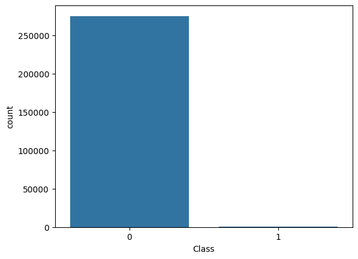
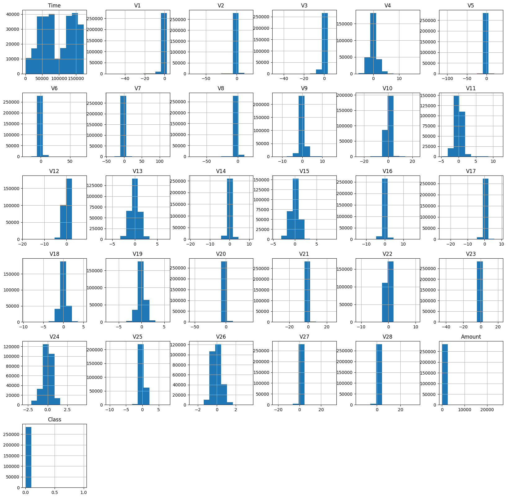
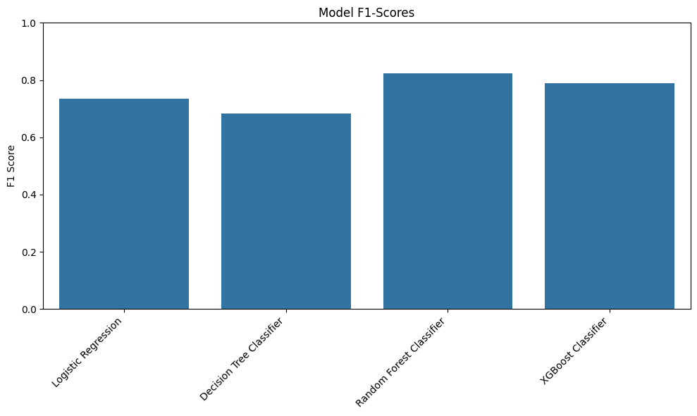
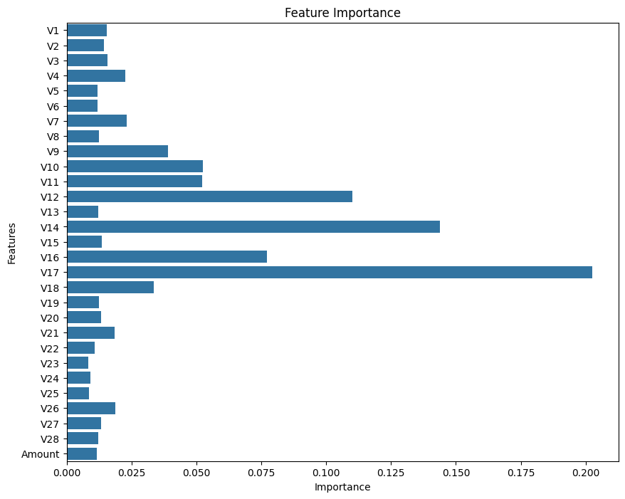

# Credit Card Fraud Detection

## 📌 Overview
This project focuses on detecting fraudulent credit card transactions using machine learning. It involves exploratory data analysis (EDA), handling severe class imbalance, and evaluating multiple classification algorithms. The goal is to build models that can accurately identify fraud while minimizing false positives. It is important that credit card companies are able to recognize fraudulent credit card transactions so that customers are not charged for items that they did not purchase.

## Dataset and Insights

The [`dataset`](https://www.kaggle.com/datasets/mlg-ulb/creditcardfraud) contains transactions made by credit cards in September 2013 by European cardholders. This dataset presents transactions that occurred in two days, where we have 492 frauds out of 284,807 transactions.

* Class Imbalance: Only 17.3% of transactions are fraudulent — a serious imbalance that can bias models toward predicting the majority class.
  
### Visual


* Feature Distributions:

* The Class histogram shows an extreme skew toward legitimate transactions (0) vs fraudulent (1).

* PCA-transformed features (V1–V28) are mostly centered around zero with varying skewness.

* Time, V4, and Amount have wider and more varied distributions.

### Visual


* Data Quality: No missing values found.

* Imbalance Solution: Applied SMOTE (Synthetic Minority Oversampling Technique) to generate synthetic fraudulent samples for balanced training.

## 🛠 Methodology
EDA: Visualized class imbalance and feature distributions.

Preprocessing: Scaled features, split into training/testing sets.

````
# scale amount and time columns
scaler = StandardScaler()
df["Amount"] = scaler.fit_transform(df["Amount"].values.reshape(-1,1))

# Dropping time column
df = df.drop(["Time"], axis=1)
````
> Time variable was dropped because it wasn't an important feature in predicting fraud

Balancing: Used SMOTE to equalize class representation.

````
# setting variables for training
X = df.drop("Class", axis = 1)
y = df["Class"]

# training
X_train, X_test, y_train, y_test = train_test_split(X, y, test_size=0.2, random_state=42)

# addressing imblances using SMOTE
smote = SMOTE(random_state=42)
X_train_resampled, y_train_resampled = smote.fit_resample(X_train, y_train)

y_train_resampled.value_counts()
````

Modeling: Trained and evaluated Logistic Regression, Decision Tree, Random Forest, and XGBoost classifiers.

````
# Models
classifier = {
    "Logistic Regression": LogisticRegression(),
    "Decision Tree Classifier": DecisionTreeClassifier(),
    "Random Forest Classifier": RandomForestClassifier(),
    "XGBoost Classifier": xgb.XGBClassifier()
}


for name, clf in classifier.items():
    print(f"\n=========={name}===========")
    clf.fit(X_train, y_train)
    y_pred = clf.predict(X_test)
    print(f"\n Accuaracy: {accuracy_score(y_test, y_pred)}")
    print(f"\n Precision: {precision_score(y_test, y_pred)}")
    print(f"\n Recall: {recall_score(y_test, y_pred)}")
    print(f"\n F1 Score: {f1_score(y_test, y_pred)}")

````

Evaluation: Compared performance using precision, recall, and F1-score to ensure balanced detection performance.

## 📈 Model Selection and Performance

### Reason for Model Choices

* Logistic Regression: Its a simple, fast, and highly interpretable baseline model and a great starting point to understand the basic relationships between your features and the target variable.

* Decision Tree: Its a non-linear model that is good at capturing complex, rule-based patterns. It's useful for finding specific combinations of features that may indicate fraud.

* Random Forest: This is an ensemble model that combines many Decision Trees. It's known for its high accuracy and ability to reduce overfitting. It's a powerful and robust choice for this kind of classification problem.

* XGBoost: A state-of-the-art Gradient Boosting model known for its performance and speed. It's highly effective for imbalanced datasets and is often a top performer in competition. This makes it essential to understand how it can optimize this specific problem

| Model                     | Precision | Recall  | F1 Score |
|---------------------------|-----------|---------|----------|
| **Logistic Regression**   | 0.8906    | 0.6264  | 0.7355   |
| **Decision Tree**         | 0.6566    | 0.7143  | 0.6842   |
| **Random Forest**         | 0.9189    | 0.7473  | 0.8242   |
| **XGBoost**               | 0.8784    | 0.7143  | 0.7879   |

### Visual



Key Takeaways:

* Random Forest delivered the highest F1-score (0.8242), offering a strong balance between precision and recall.

* Logistic Regression maintained high precision but lower recall, meaning it caught fewer fraudulent cases.

* Decision Tree underperformed compared to ensemble methods.

* XGBoost was competitive with Random Forest, showing strong precision-recall trade-offs.

## 📌 Feature Importance

### Visual


> This analysis shows that when the model is making a decision about whether a transaction is fraudulent or not, the value of the 'V14' feature is the single most influential factor. Even though, many of the other 'V' features, as well as 'Amount', have very low or almost zero importance. This doesn't necessarily mean they are useless, but the model has found that 'V14', 'V17', and 'V12' are the most powerful predictors.

## 📌 Conclusion
Addressing class imbalance is crucial in fraud detection.

Ensemble methods like Random Forest and XGBoost outperform single learners for this dataset.

SMOTE significantly improved recall for all models.

> This dataset represents real-world credit card transactions made in September 2013 by European cardholders, covering just two days of activity. Out of 284,807 total transactions, only 492 were fraudulent—a mere 0.172% of all records. This extreme imbalance mirrors real industry conditions, where fraudulent cases are rare but costly, making detection both critical and challenging. By applying SMOTE to balance the training data and evaluating multiple models, we were able to significantly improve recall without severely compromising precision. Ensemble methods like Random Forest and XGBoost achieved the strongest performance, making them ideal candidates for production scenarios where both false positives and missed frauds carry high costs.

## 🚀 Future Improvements
Test advanced ensemble and boosting variants (e.g., LightGBM, CatBoost).

Perform feature engineering to capture temporal transaction patterns.

Implement real-time fraud detection pipelines for production.

Explore anomaly detection methods for unsupervised fraud spotting.
